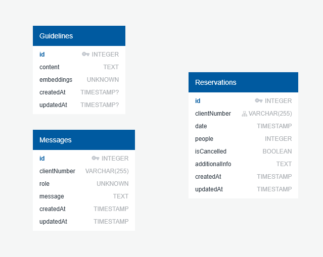

# Ai agent challenge

The main goal is to build an AI agent that is able to dynamically adapt its prompt to user given guidelines.

These behavioural guidelines are retrieved from a database and change based on the input of the user.

## The use case

For the project I've decided to go with a **restaurant reservations system**.

The main points to address were:

- It should be able to handle the entire process of creating, modifying and cancelling customers reservations
- It should be able to attend inquiries from the customers and resolve them. In this MVP the allergies are a main inquiry for the agent to address.
- It should be able to remember past messages and include any relevant detail (Such as the allergies) from the customer

## Architecture

I have decided to create an API REST to handle the conversations and the creation of new guidelines for the system. However, I also implemented a Telegram integration so all the user-facing functionality is available via chat.

### The API

---

The API is a NestJS project and it is organized as a MVC project. I also considered applying DDD but it felt overkill for the MVP.

However, I think that if this MVP were to grow it would make sense to implement at least the port adapter pattern (Hexagonal architecture), since it would make easier if the project required integrate with other chat platforms (Such as Whatsapp) or require other AI models use (Currently used OpenAI models).

The MVC I applied is a little different though, since I made a differentiation between my models and my services, which at this scale it made easier working on the project, but made almost all the business logic go to the services folder instead.

The general folder structure is as follows:

      - src -> Apart from the following folders it has also the NestJS specific files such as the main module and the main controller.
        - Dto -> Used for Data Transfer Objects for both input and output at the API
        - Models -> It contains the models used in the project.
        - Services -> It contains almost all the business logic for the project. It is divided in context for better understanding
        - Types -> At the moment it contains error custom messages
      - tools -> This folder contains scripts for generating the seeders and migrations scripts for sequelize. This was required since sequelize generates its own but it doesn't support typescript.
      - db -> This folder contains the sequelize configuration file and the migration and seed scripts.

The templates used for the sequelize tools was found in [this article](https://dev.to/anshul_02/migrations-with-sequelize-typescript-174j)

> Note: No folders were created for the modules and the controllers because it didn't make much sense if the project only has one of each

As other relevant tools used in the project are [Vercel AI SDK](https://v5.ai-sdk.dev/docs/introduction) for AI interaction, [Sequelize](https://sequelize.org/) as an ORM and [grammY](https://grammy.dev/) for Telegram integration

> **IMPORTANT**: At this project you will find a couple of hardcoded credentials (In [docker compose](docker-compose.yml), in the sequelize config module and in the [config.json](db/config.json) file). These credentials are for the local database and they are there to make easier testing the MVP.
>
> In a full working project all the credentials should go in the **enviroment variables**

### The Database

---

The used database is PostgreSQL.
This database supports vector storage with `pgvector` extension which is critical for some of the functionality of the project. It is also used in Supabase Vector so it made even more sense to use this.

The diagram is the following:

### Docker

---

This project has a custom init sql script that is injected in the container created by docker compose that enables the `vector` extension in the database

## How it works

When the project boots up, the NestJS API expose two endpoints:

- `PUT /guideline`
- `POST /chat`

### /guideline

---

This endpoint take the user instruction as input. Ideally it should follow [Parlant](https://www.parlant.io/docs/concepts/customization/guidelines/#managing-guidelines) suggestions, which I found to be quite effective.

It then proceeds to call OpenAI API to generate the **embeddings** for the given input.

> An embedding is a vector of floating point numbers and it is used to measure relatedness of text strings. Small distances between two vectors suggest high relatedness and large distances suggest the opposite.
>
> You can learn more about embeddings in [OpenAI docs](https://platform.openai.com/docs/guides/embeddings)

After generating the embeddings using model `text-embedding-3-small`, it then proceeds to save it in the database with the content. This is handled in [GuidelinesCreatorService](src/Services/Guidelines/GuidelinesCreator.service.ts)

### /chat

---

This endpoint is what makes everything work. It receives the user message and a phone number as input.

The phone number will be used as a way to identify the user that is doing the reservation

> Because of time constraints no authentication method has been implemented

The first thing it does is to transform the user input in embeddings so it can compare it with the guidelines.
After that it queries the database for the related guidelines and takes the 5 most similar. It does this in [EmbeddingsSearchService](src/Services/Embeddings/EmbeddingsSearch.service.ts)

> The query used for the embeddings was found in [this article](https://medium.com/@fenil3357/vector-similarity-search-using-postgres-sequelize-and-express-js-eaedcf340d2a) which also explains really well how does vector similarity search work

With the guidelines already retrieved it then proceeds to build the message history. It does this using the data present in the table `Messages`, which get saved after each message in the conversation.

Then it goes into the [Agent service](src/Services/Agent/Agent.service.ts) and builds the system prompt using the retrieved guidelines.

> The way it is built we can add to the prompt as many guidelines as we want, but to keep it simple I chose to only take 5

When the system prompt is built the request to the AI service is sent. The model used is OpenAI `gpt-4.1`. It get passed the message history we built and it get passed with the tools the AI will call to do its job.

    - getAllergensInfo
    - createReservation
    - updateReservation
    - cancelReservation
    - findReservation

The thinking process is made with a max of 5 steps. If we want to allow the AI to perform more functions we should increase this number.

Since the messages are displayed via an API or the Telegram integration I decided to use the non-stream option from the AI SDK.

It then saves the AI message in the history and returns it to the user.

## How to deploy

### Requirements

---

- yarn
- Docker
- An HTTP client such as Postman is not mandatory but recommended if you don't want to use curl
- A telegram account if the integration is enabled

### Env variables

In order to deploy this project locally we will need an `.env` file, you can just rename the example provided in the repo.

It is mandatory to provide a `OPENAI_API_KEY`, but not a `TELEGRAM_KEY`. If you do not provide a telegram key the integration will be disabled.

### Running the project

If it is the first time running the project you will need to run the migrations and the seed file.

1. `docker compose up` -> Start up the database
2. `yarn migrate` -> Create the required tables for startup. It will only create the `Guideline` table, the rest will get created by sequelize when the API endpoints are executed
3. `yarn seed:all` -> It will execute the seeding script. I've added myself some guidelines but feel free to modify or delete them to achieve multiple behaviours from the agent!
4. `yarn start:prod` or `yarn start:dev` -> This will launch the API, there are no differences in environments at the current state of the project other than the watch mode in `development` mode
